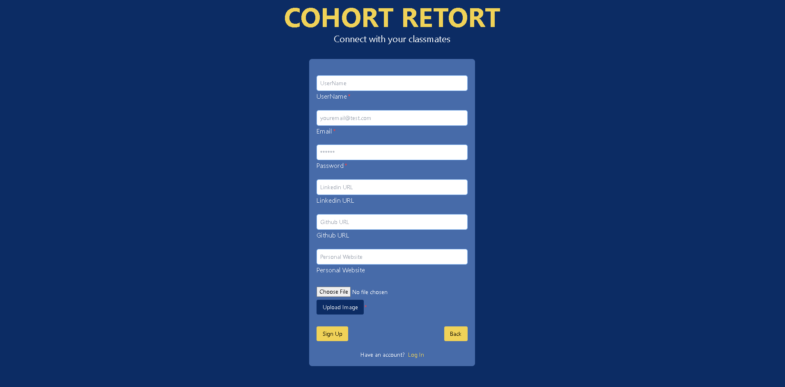
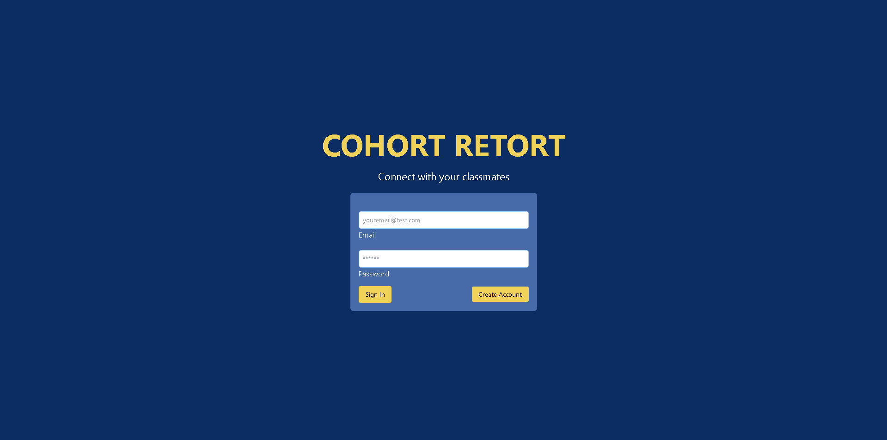

# Cohort Retort

## Description

Social Networking App using MERN. Create an account and continue networking with your former classmates!

## Table of Contents

- [Features](#features)
- [Contributors](#contributors)
- [Technologies](#technologies)
- [License](#license)
- [UI](#ui)
- [LiveSite](#livesite)

## Features

After you have created an account, you will have access to the following features:

1. **Access to Community Page**: Here you will be able to view and interact with other users.

2. **Create Posts**: Share your job posting or request via a post on the Community Page. You can also delete your posts if you want. Update post option will be implemented soon.

3. **Create Comments**: Comment on any post to join in the conversation.

4. **Profile**: Here you can see your information that you're sharing on the site and can update your Username, Github and LinkedIn links. In the future you will be able to update all of your information and profile picture.

Many more features to come!

## Contributors

This application was developed by the following contributors:

- [Scott Hale](https://github.com/shale00)
- [Oscar Leal](https://github.com/Oscarl214)
- [Whitney White](https://github.com/Whitney15)
- [Michael Formico](https://github.com/MichaelFormico)
- [Tim Mackie](https://github.com/Timmackie)

## UI

1. Sign Up Page

2. Login Page

3. Home Page

4. Profile Page

## Technologies

The Cohort-Retort application was built using the following:

- MongoDB
- Express.js
- React
- Node.js
- SWS S3 Service
- GraphQL
- Apollo Server Express
- Bycript
- Mongoose
- TailwindCSS

## License

    This app is licensed under the MIT license.

## LiveSite

(https://cohort-retort-v1-3ead1d24c761.herokuapp.com/)
